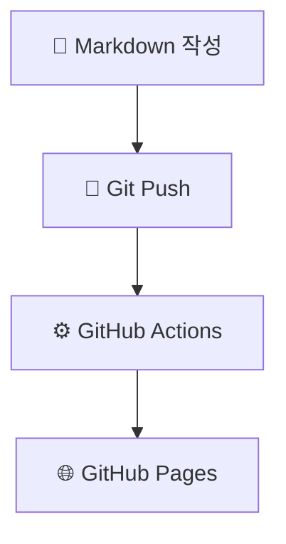

# Giljae's Digital Garden

환영합니다! 이곳은 Gollum 기반 위키입니다.

[[_TOC_]]

## 시작하기

- [[Getting-Started]]를 읽어보세요
- [[Plugins]]에서 사용 가능한 기능을 확인하세요
- 페이지는 Markdown으로 작성합니다
- `[[페이지이름]]` 형식으로 다른 페이지에 링크할 수 있습니다

## 예시

<<Note("헤더 검색창으로 페이지를 찾고, 🌙 버튼으로 다크 모드를 켤 수 있습니다.")>>

## 최근 업데이트

이 위키는 Git으로 관리되며, GitHub Pages에 자동 배포됩니다.
