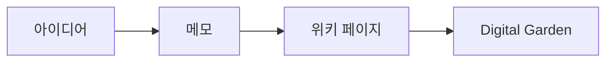

# 플러그인 & 기능

이 위키에서 사용할 수 있는 기능들입니다.

## 목차 (TOC)

페이지 상단에 `_TOC_` 매크로를 추가하면 자동 목차가 생성됩니다. (Gollum 문법: 이중 대괄호로 감싼 `_TOC_`)

## Mermaid 다이어그램



## 수학 (KaTeX)

인라인: $E = mc^2$

블록:

$$
\int_0^\infty e^{-x^2} dx = \frac{\sqrt{\pi}}{2}
$$

## 알림 박스 (Gollum 매크로)

<<Note("이것은 참고 사항입니다.")>>

<<Warn("주의가 필요한 내용입니다.")>>

## 검색

헤더의 검색창에서 모든 페이지를 검색할 수 있습니다.

## 다크 모드

헤더 오른쪽의 🌙/☀️ 버튼으로 테마를 전환합니다. 설정은 브라우저에 저장됩니다.

## 코드 블록

```ruby
def hello
  puts "Hello, Garden!"
end
```

코드 블록에 마우스를 올리면 **Copy** 버튼이 나타납니다.

## 페이지 링크

| 문법 | 결과 |
|------|------|
| `[[Page]]` | 다른 페이지로 링크 |
| `[[Page\|표시이름]]` | 링크 텍스트 지정 |

## 로컬 Gollum에서 사용

Docker로 Gollum을 실행하면 KaTeX와 Mermaid가 활성화됩니다:

```bash
docker compose up
```
